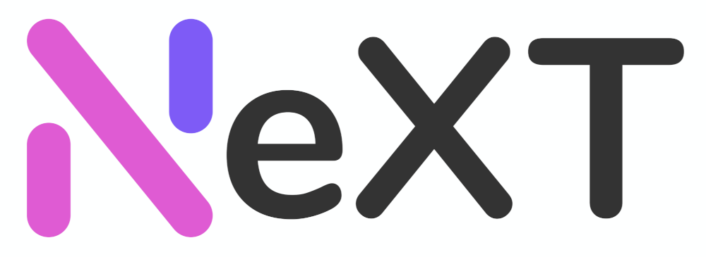

## Notice

1. Every Edition of NeXT Panel starting with version 26 will be encoded with ionCube to protect key features and their implementation; therefore, the ionCube loader must be configured in your PHP environment before you can install NeXT Panel.

2. The only official repo of the NeXT panel is [The-NeXT-Project/NeXT-Panel](https://github.com/The-NeXT-Project/NeXT-Panel) on GitHub.

## Pro Edition

NeXT Panel (Pro Edition) is a multipurpose proxy service management system designed for Shadowsocks(2022) / Vmess / Trojan / TUIC protocol, it has redesigned system architecture and replaced many of its PHP-based backends with high-performance Golang-based ones, and significantly improved site response time under heavy load.

The Pro version will use a yearly subscription model, we plan to provide a dedicated license purchase site and existing patron members can access it as well. We will publish further pricing info on our [Discord Server](https://discord.gg/A7uFKCvf8V) and [Twitter Account](https://x.com/TheNeXTProjekt), please stay tuned.

## Feature Comparison(Free vs Pro)

| Feature                                                                                                                   | Free Edition | Pro Edition |
|---------------------------------------------------------------------------------------------------------------------------|-------------|-------------|
| Core PHP Backend & Htmx/jQuery Frontend                                                                                   | ✅           | ✅         |
| Golang-based high-performance Node/User/Admin API                                                                         | ❌           | ✅(WiP)    |
| Golang-based high-performance statistical API that can support real-time client-side updates & server events              | ❌           | ✅(WiP)    |
| Access to over the air(OTA) service that provides one-click software update                                               | ❌           | ✅(WiP)    |
| Access to our experimental risk management API that can filter out potential spam/malicious/abusing users                 | ❌           | ✅(WiP)    |
| Access to our prebuilt Docker Image repository that supports frictionless site setup/update/migration experience          | ❌           | ✅         |
| Support for PostgreSQL in addition to the currently supported MariaDB as the main database                                | ❌           | ✅         |
| Easy to use panel initialization wizard, no CLI operation is needed                                                       | ❌           | ✅         |
| Integration with other cluster management system(Ansible/SaltStack), automatically manage your proxy servers in one place | ❌           | ✅(WiP)    |

Note some of the features will not be available on the Pro Edition on day one, we expect those features will be gradually rolled out in the coming months.

## Ecosystem

- [NeXT Server](https://github.com/The-NeXT-Project/NeXT-Server)
- NeXT Desktop (WiP)
- [NetStatus-API-Go](https://github.com/The-NeXT-Project/NetStatus-API-Go)

## Documentation

[NeXT Panel Docs](https://nextpanel.dev/docs)

## Blog

[NeXT Panel Blog](https://nextpanel.dev/blog)

## Support

<a href="https://www.patreon.com/catdev">Patreon (One time or monthly)</a>

<a href="https://www.vultr.com/?ref=8941355-8H">Vultr Ref Link</a>

<a href="https://www.digitalocean.com/?refcode=50f1a3b6244c">DigitalOcean Ref Link</a>

## License

[GPL-3.0](./LICENSE)

## Star History

